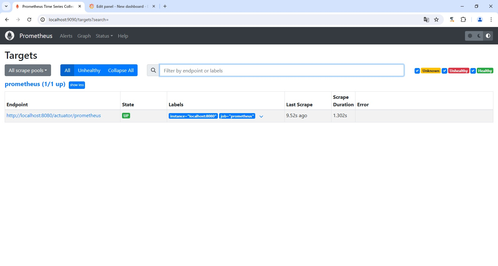
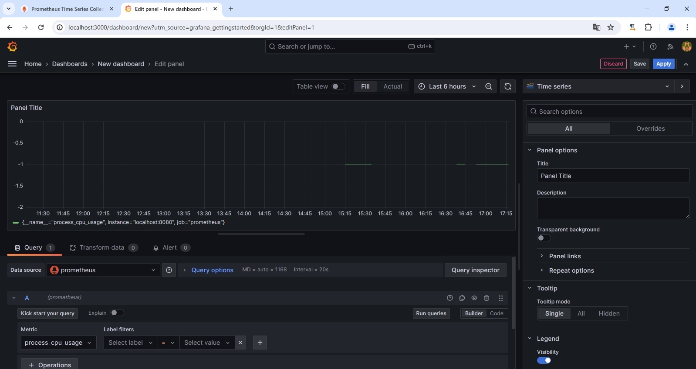
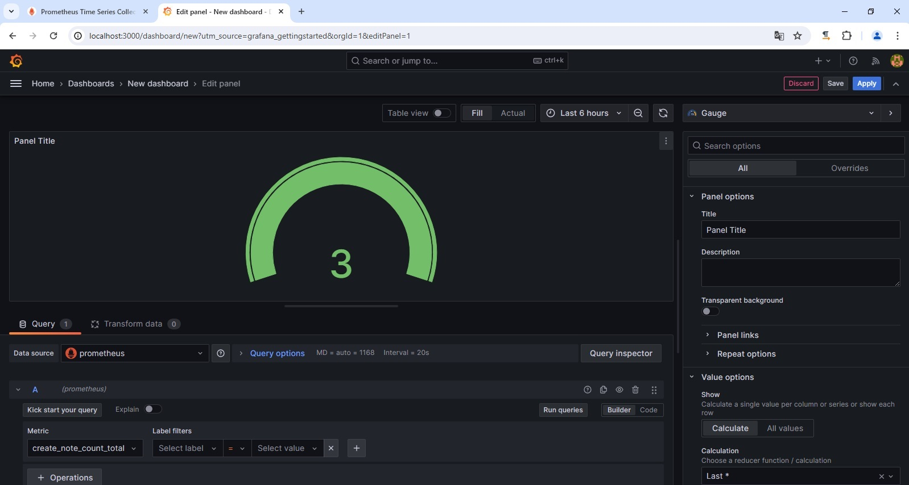
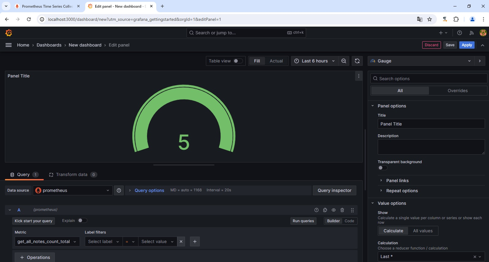

# Фреймворк Spring

## Урок 11. Spring Actuator. Настройка мониторинга с Prometheus и Grafana.

### Задание: Используйте Spring Actuator для отслеживания метрик вашего приложения. Настройте визуализацию этих метрик с использованием Prometheus и Grafana.

 

#### Использование Prometheus

 

#### Метрика потребления ресурсов процессора, с использованием Grafana

 

#### Метрика подсчета созданных заметок, с использованием Grafana

 

#### Метрика подсчета просмотра всех заметок, с использованием Grafana

